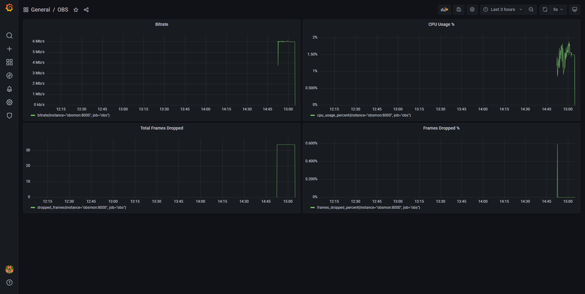

# obsmon

A tool to monitor and graph OBS statistics using Prometheus and Grafana

## Setup

1. Download and install [obs-websocket](https://obsproject.com/forum/resources/obs-websocket-remote-control-obs-studio-from-websockets.466/).

2. Install [docker](https://www.docker.com/get-started) on the machine you want to use for monitoring.

3. Clone this repository

4. Edit `OBS_URL`, `OBS_PORT`, `OBS_PASSWORD` inside of `docker-compose.yml` to match your obs-websocket settings

5. Run `docker-compose up -d` in the main directory

6. View your dashboard at `http://localhost:3000` (login is `admin`:`admin`)

If you need any help with setup, feel free to reach out to me on Discord at `Zusor#3333`